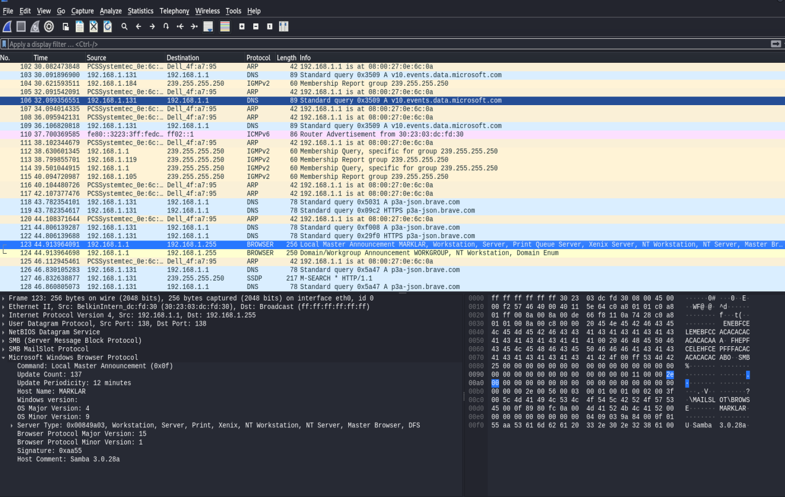
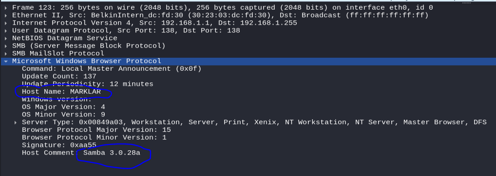
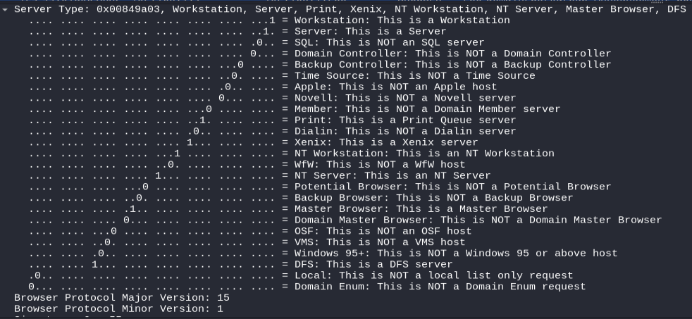
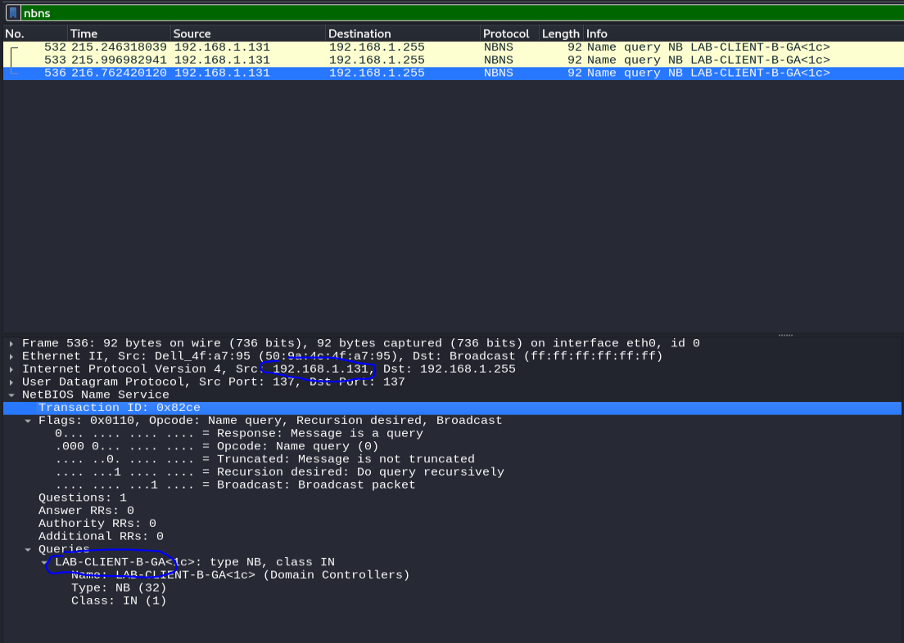
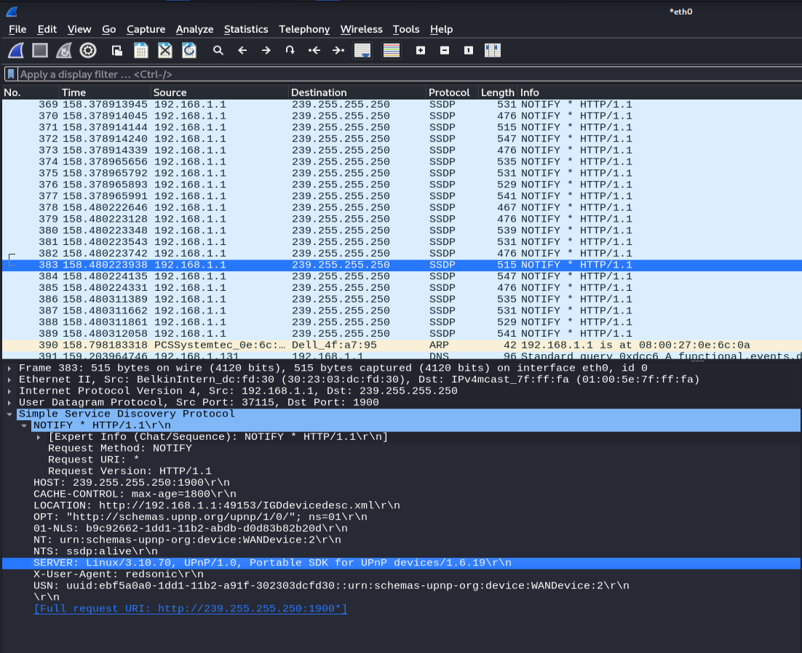
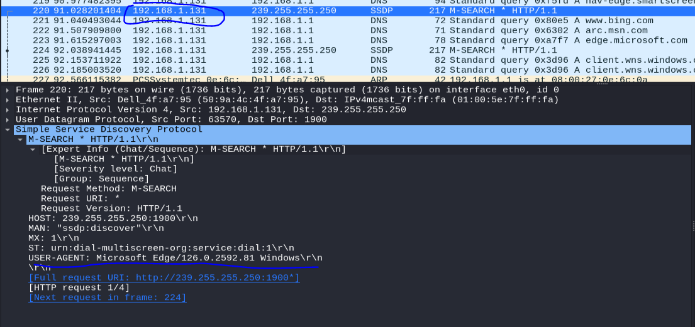
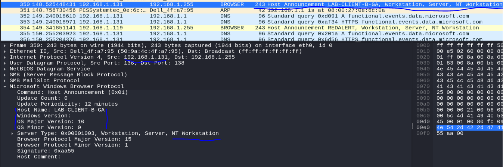

# ARP-Spoofing

This lab demonstrates how to perform an ARP Spoofing attack, also referred to as ARP Poisoning, Man-in-the-Middle, or On-path attack, on a Local Area Network using the arpspoof tool in Kali Linux. This lab was conducted in a segmented LAN environment to demonstrate the process of performing active reconnaissance with Nmap to enumerate operating system details from the host and to carry out an ARP spoofing attack on the target system. Once the ARP spoofing attack is initiated, further enumeration is performed using Wireshark.

## Active Reconnaissance on the Target using Nmap

## Initiating the ARP Spoofing Attack with arpspoof

## Analyzing the Traffic with Wireshark

### Identifying DNS Server IP Address

### NetBIOS and Other Information

### SSDP Enumeration

#### Other Host Information

