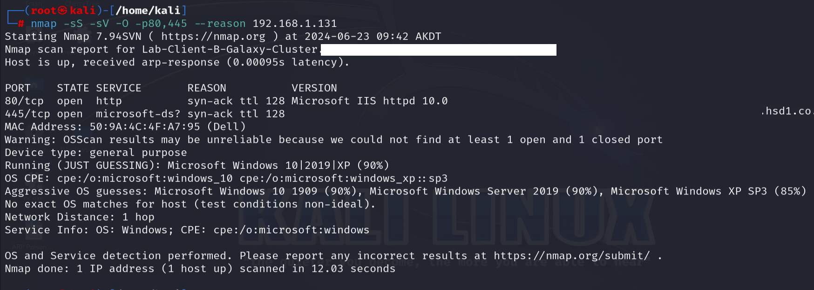
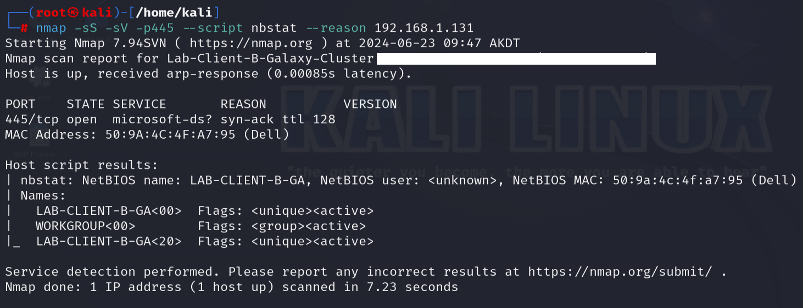

# ARP-Spoofing

This lab demonstrates how to perform an ARP Spoofing attack also referred to as ARP Poisoning, Man-in-the-Middle, or On-path attack on a Local Area Network. Using the arpspoof tool in Kali Linux. The subject target in this lab is a Windows 10 machine assigned to the IPv4 address of 192.168.1.131. This Windows 10 machine was setup in a contained virtualized environment to demonstrate the process of performing active reconnaissance with nmap to enumerate operating system details from the host and to carry out the process of performing an APR spoofing attack on the target system. Once the the ARP spoofing attack is initiated - further enumeration is performed with the use of Wireshark. 

## Active Reconnaissance on the Target using Nmap

## Initiating the ARP Spoofing Attack with arpspoof

## Analyzing the Traffic with Wireshark

### Identifying DNS Server IP Address

### NetBIOS Enumeration

### SSDP Enumeration

#### Other Host Information

