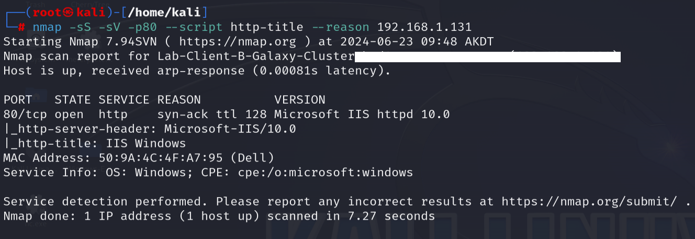

# ARP-Spoofing

This lab demonstrates how to perform an ARP Spoofing attack also referred to as ARP Poisoning, Man-in-the-Middle, and On-path attack on a Local Area Network. Using the arpspoof tool in Kali Linux. The subject target in this lab is a Windows 10 machine assigned to the IPv4 address of 192.168.1.131. This Windows 10 machine was setup in a contained virtualized environment to demonstrate the porcess of performing active reconnaissance to enumerate operating system details from the host and to carry out the process of performing an APR spoofing attack on the target system. 

